# Ecommerce Backend API

Oleh Bayu Rizky Kurnia Pratama - 2205551070

## Daftar Isi

-   [Ecommerce Backend API](#ecommerce-backend-api)
    -   [Daftar Isi](#daftar-isi)
    -   [Pengenalan](#pengenalan)
    -   [Alat](#alat)
    -   [Prasyarat](#prasyarat)
    -   [Batasan Program](#batasan-program)
    -   [Penggunaan](#penggunaan)
        -   [Persiapan](#persiapan)
        -   [Otorisasi](#otorisasi)
        -   [GET](#get)
        -   [POST](#post)
        -   [PUT](#put)
        -   [DELETE](#delete)
    -   [Penutup](#penutup)

## Pengenalan

Program **E-commerce Backend API** adalah program yang memungkinkan pengguna untuk terhubung dan memanipulasi basis data dari _e-commerce_ tersebut.

## Alat

Berikut alat yang digunakan untuk membangun program ini:

-   IntelliJ IDEA

IntelliJ IDEA adalah sebuah lingkungan pengembangan terintegrasi (IDE) yang digunakan oleh para pengembang perangkat lunak. Dikembangkan oleh JetBrains, IntelliJ IDEA menawarkan berbagai fitur yang kuat dan canggih untuk membantu dalam pengembangan aplikasi. IDE ini menawarkan editor kode yang cerdas dengan dukungan penuh untuk banyak bahasa pemrograman, pemformatan otomatis, penyelesaian kode, debugging, serta integrasi dengan sistem manajemen versi. Selain itu, IntelliJ IDEA menyediakan alat bantu untuk pengujian, pengelolaan _dependency_, dan _refactor code_.

[Download IntelliJ IDEA](http://code.visualstudio.com/download)

-   DB Browser for SQLite

DB Browser for SQLite adalah perangkat lunak yang digunakan untuk mengelola dan mengakses basis data SQLite. SQLite merupakan sistem manajemen basis data yang ringan. Dengan menggunakan DB Browser for SQLite, pengguna dapat dengan mudah memanipulasi data pada basis data SQLite. Alat ini berguna bagi pengembang perangkat lunak, analis data, atau siapa pun yang perlu berinteraksi dengan database SQLite melalui GUI.

[Download DB Browser for SQLite](https://sqlitebrowser.org/dl/)

## Prasyarat

Adapun prasyarat untuk menjalankan program ini adalah sebagai berikut:

-   Java Development Kit versi 11

[Download JDK](https://www.oracle.com/id/java/technologies/downloads/archive/)

-   Jackson versi 2.14.2

[Download Jackson](https://mvnrepository.com/artifact/com.fasterxml.jackson.core/jackson-databind/2.14.2)

-   SQLite JDBC versi 3.36.0.3

[Download SQLite JDBC](https://mvnrepository.com/artifact/org.xerial/sqlite-jdbc/3.36.0.3)

-   Dotenv Java 3.0.0

[Download Dotenv Java](https://github.com/cdimascio/dotenv-java)

## Batasan Program

-   Hanya _request method_ GET, POST, PUT, dan DELETE yang dizinkan.

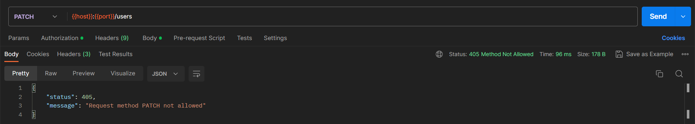

-   Tidak diperkenankan kesalahan dalam penulisan nama tabel, berikut daftar tabel dengan penulisan yang tepat:

```
users
products
orders
orderDetails
addresses
reviews
```

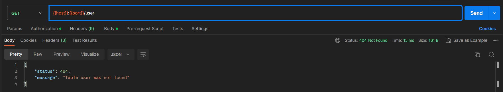

-   ID merupakan bilangan bulat dari 1 sampai batas kolom pada tabel tertentu.

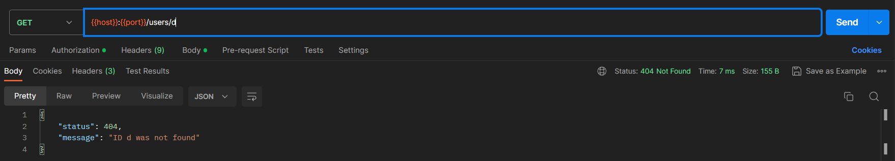

-   Parameter pada URL harus sesuai dengan ketentuan, untuk lebih detailnya pada [GET](#get) bagian **`localhost:8070/{table}?{params}`**


-   Format _request body_ yang diterima pada _request method_ POST dan PUT hanyalah JSON atau _JavaScript Object Notation_

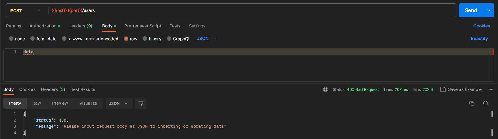

## Penggunaan

Berikut adalah langkah-langkah untuk menjalankan program ini:

#### Persiapan

Untuk dapat melakukan _clone_ repositori ini dengan menggunakan _command_ Git sebagai berikut:

```
$ git clone https://github.com/bayurkp/Java-Backend-API
```

Setelah melakukan _cloning_, Anda harus memenuhi prasyarat pada bagian sebelumnya. Karena proyek ini menggunakan Maven sebagai _build system_-nya maka untuk melaukan instalasi, gunakan _command_ berikut:

```
$ mvn install
```

Jalankan `com.bay.server.Main.main` maka Anda dapat mengakses program API ini pada:

```
localhost:8070
```

#### Otorisasi

Program ini menggunakan API _Key_ untuk otorisasi atau _authorization_. Berikut adalah API _Key_ yang digunakan untuk otorisasi:

```
bay_a21dfce2c27396ca29a322bf3d9fe9ffd46339f8197973002d239fb7fe13566c
```

Mohon masukkan _key_ tersebut pada bagian _request header_ dengan ketentuan sebagai berikut:

```
curl -H "Content-Type: application/json" -H "api-key: bay_a21dfce2c27396ca29a322bf3d9fe9ffd46339f8197973002d239fb7fe13566c" localhost:8070/{tableName}
```

Atau pada aplikasi Postman, Anda dapat melakukan konfigurasi sebagai berikut:

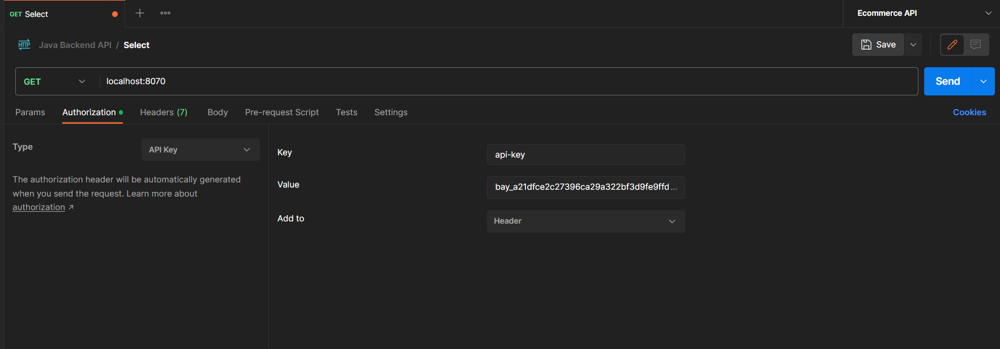

Berikut pesan yang dikirimkan jika pengguna tidak menggunakan _API Key_.

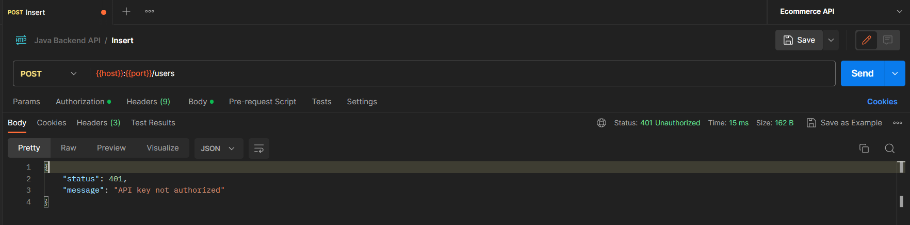

#### GET

Metode GET digunakan untuk mengambil data dari server.

-   **`localhost:8070/{table}`**

Menampilkan seluruh data pada tabel **`{table}`**.

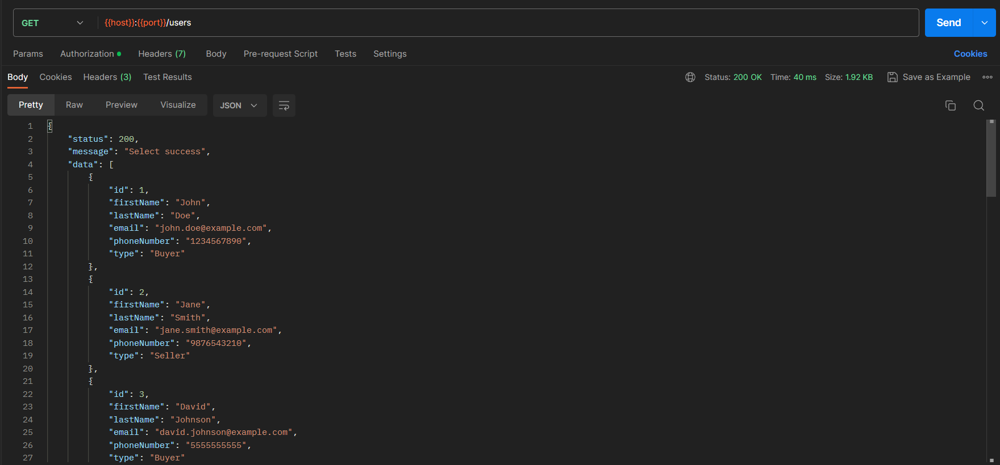

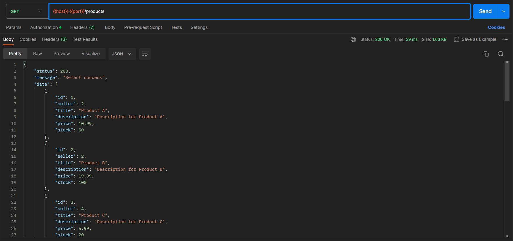

-   **`localhost:8070/users/{id}`**

Menampilkan informasi _user_ dan alamatnya.

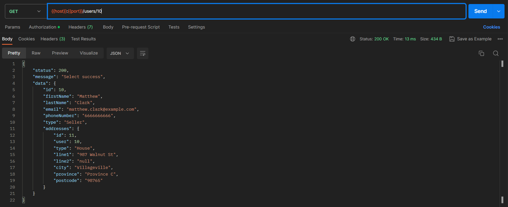

-   **`localhost:8070/users/{id}/products`**

Menampilkan daftar semua produk milik user ber-ID {id}.

")

-   **`localhost:8070/users/{id}/orders`**

Menampilkan daftar semua _order_ milik _user_ ber-ID {id}.

")

-   **`localhost:8070/users/{id}/reviews`**

Menampilan semua _review_ yang dibuat oleh _user_ ber-ID {id}.

")

-   **`localhost:8070/orders/{id}`**

Menampilkan informasi _order_, _buyer_, _order detail_, _review_, _title_ produk, dan _price_

")

-   **`localhost:8070/products/{id}`**

Menampilkan daftar produk ber-ID {id} beserta identitas _seller_.

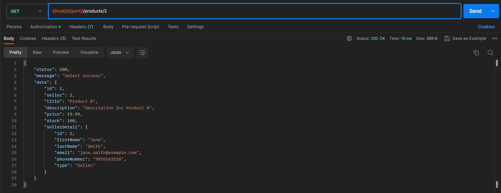

-   **`localhost:8070/{table}?{params}`**

Menampilkan data berdasarkan parameter pada _request query_. Terdapat beberapa ketentuan untuk _key_ dan _value_ dari parameter yang bisa digunakan:

```
f = field
c = condition
v = value
```

Kondisi yang dapat digunakan antara lain:

```
greaterEqual    (>=)
greater         (>)
lessEqual       (<=)
less            (<)
equal           (=)
notEqual        (<>)
```

Berikut contoh penggunaannya:

```
localhost:8070/products?f=stock&c=greaterEqual&v=30
```

Berikut hasilnya:

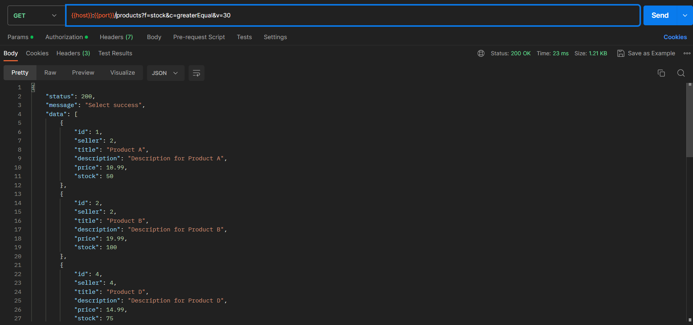

Atau, Anda dapat menggunakan _query_ untuk _field_ tertentu seperti contoh berikut:

```
localhost:8070/users?firstName=John
```

Berikut hasilnya:

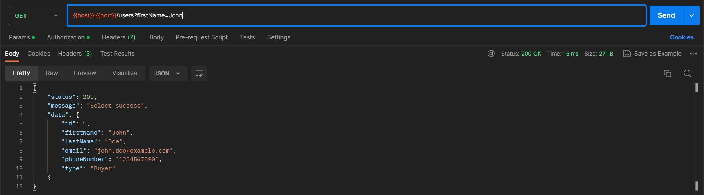

#### POST

Metode POST digunakan untuk mengirimkan data ke server.

-   **`localhost:8070/{table}`**

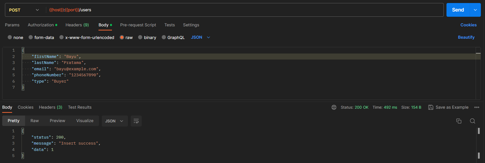
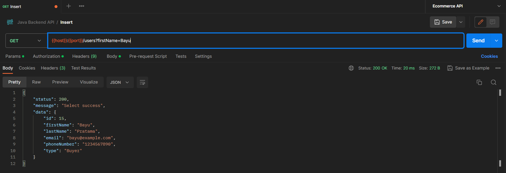

#### PUT

Metode PUT digunakan untuk mengubah data pada server.

-   **`localhost:8070/{table}/{id}`**

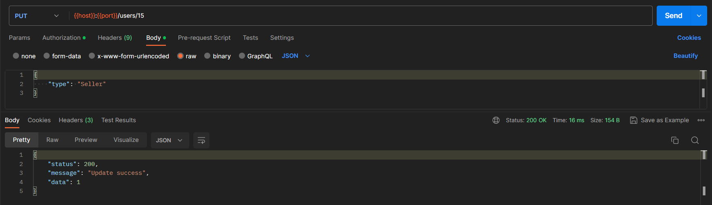
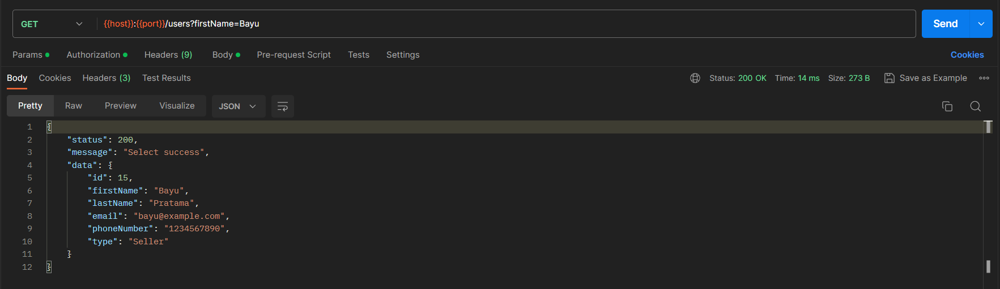

#### DELETE

Metode DELETE digunakan untuk menghapus data pada server.

-   **`localhost:8070/{table}/{id}`**

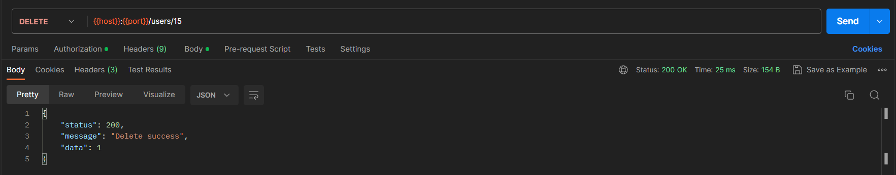
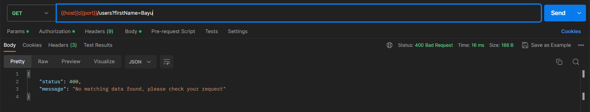

## Penutup

Terimakasih.
# Tugas-API-2
